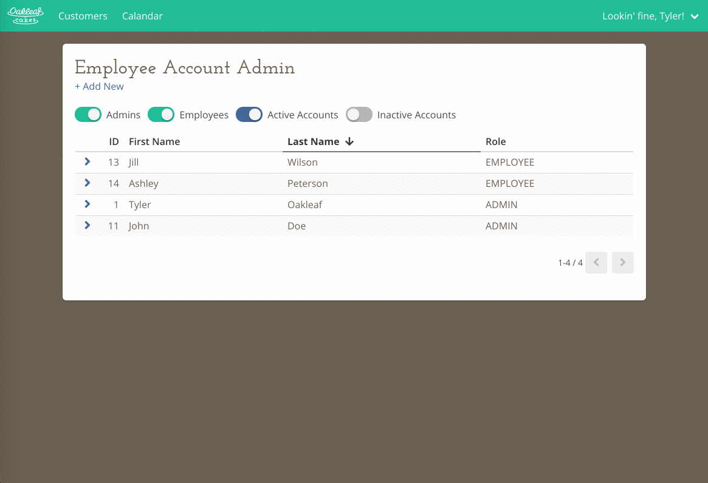

# Web UI for the Oakleaf Cakes Bake Shop Customer Relationship and Order Management API

View the accompanying API project here: (https://github.com/toakleaf/oakleafcakes-crm-api)

## Project setup

Open /src/axiosAPI.js, and alter following line to point to api:

```
baseURL: 'http://localhost:3000'
```

Then:

```
yarn install
```

### Compiles and hot-reloads for development

```
yarn run serve
```

### Compiles and minifies for production

```
yarn run build
```

## Previews

Here are some previews of what the UI looks like.

### Login and Customer Search

This shows a small bit of the user interface in action to get a feel for how it works. Login, search for customer accounts via autocomplete, edit accounts, etc...


### Calendar View

This shows the custom built calendar and date picker components that can dynamically scale to accommodate all screen sizes.


### Employee Admin

Another small bit of the user interface. Shows table view, sorting, and form field verification including email duplicate check.

